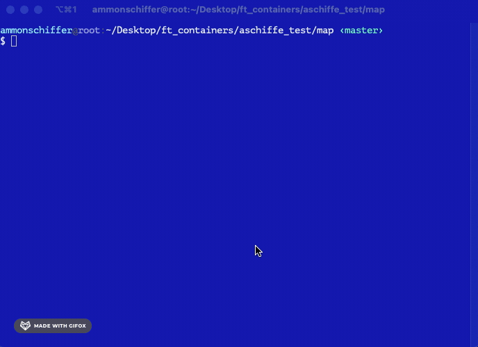

# ft_containers
Reimplement the STL, version C++98, in a basic way.


## Containers Library :

### **Stack :**

LIFO stack
Stacks are a type of container adaptor, specifically designed to operate in a LIFO context (last-in first-out), where elements are inserted and extracted only from one end of the container.  
  
**stack's** are implemented as  _container adaptors_, which are classes that use an encapsulated object of a specific container class as its  _underlying container_, providing a specific set of member functions to access its elements. Elements are  _pushed_/_popped_  from the  _"back"_  of the specific container, which is known as the  _top_  of the stack.  
  
The underlying container may be any of the standard container class templates or some other specifically designed container class. The container shall support the following operations:  

-   empty
-   size
-   back
-   push_back
-   pop_back

  
The standard container classes  [vector](https://cplusplus.com/vector),  [deque](https://cplusplus.com/deque)  and  [list](https://cplusplus.com/list)  fulfill these requirements. By default, if no container class is specified for a particular  stack  class instantiation, the standard container  [deque](https://cplusplus.com/deque)  is used.
<br>
### **Vector :**

Vectors are sequence containers representing arrays that can change in size.  
  
Just like arrays, vectors use contiguous storage locations for their elements, which means that their elements can also be accessed using offsets on regular pointers to its elements, and just as efficiently as in arrays. But unlike arrays, their size can change dynamically, with their storage being handled automatically by the container.  
  
Internally, vectors use a dynamically allocated array to store their elements. This array may need to be reallocated in order to grow in size when new elements are inserted, which implies allocating a new array and moving all elements to it. This is a relatively expensive task in terms of processing time, and thus, vectors do not reallocate each time an element is added to the container.  
  
Instead, vector containers may allocate some extra storage to accommodate for possible growth, and thus the container may have an actual  [capacity](https://cplusplus.com/vector::capacity)  greater than the storage strictly needed to contain its elements (i.e., its  [size](https://cplusplus.com/vector::size)). Libraries can implement different strategies for growth to balance between memory usage and reallocations, but in any case, reallocations should only happen at logarithmically growing intervals of  [size](https://cplusplus.com/vector::size)  so that the insertion of individual elements at the end of the vector can be provided with  _amortized constant time_  complexity (see  [push_back](https://cplusplus.com/vector::push_back)).  
  
Therefore, compared to arrays, vectors consume more memory in exchange for the ability to manage storage and grow dynamically in an efficient way.  
  
Compared to the other dynamic sequence containers ([deques](https://cplusplus.com/deque),  [lists](https://cplusplus.com/list)  and  [forward_lists](https://cplusplus.com/forward_list)), vectors are very efficient accessing its elements (just like arrays) and relatively efficient adding or removing elements from its  [end](https://cplusplus.com/vector::end). For operations that involve inserting or removing elements at positions other than the end, they perform worse than the others, and have less consistent iterators and references than  [lists](https://cplusplus.com/list)  and  [forward_lists](https://cplusplus.com/forward_list).
<br>
### **Map :**

Maps are associative containers that store elements formed by a combination of a  _key value_  and a  _mapped value_, following a specific order.  
  
In a  map, the  _key values_  are generally used to sort and uniquely identify the elements, while the  _mapped values_  store the content associated to this  _key_. The types of  _key_  and  _mapped value_  may differ, and are grouped together in member type  value_type, which is a  [pair](https://cplusplus.com/pair)  type combining both:  

```
typedef pair<const Key, T> value_type;
```  
Internally, the elements in a  map  are always sorted by its  _key_  following a specific  _strict weak ordering_  criterion indicated by its internal  [comparison object](https://cplusplus.com/map::key_comp)  (of type  Compare).  
  
map  containers are generally slower than  [unordered_map](https://cplusplus.com/unordered_map)  containers to access individual elements by their  _key_, but they allow the direct iteration on subsets based on their order.  
  
The mapped values in a  [map](https://cplusplus.com/map)  can be accessed directly by their corresponding key using the  _bracket operator_  ([operator[]](https://cplusplus.com/map::operator[])).  
  
Maps are typically implemented as  _binary search trees_.
<br>  
### **Set :**

Sets are containers that store unique elements following a specific order.  
  
In a set, the value of an element also identifies it (the value is itself the _key_, of type T), and each value must be unique. The value of the elements in a set cannot be modified once in the container (the elements are always const), but they can be inserted or removed from the container.  
  
Internally, the elements in a set are always sorted following a specific _strict weak ordering_ criterion indicated by its internal [comparison object](https://cplusplus.com/set::key_comp) (of type Compare).  
  
set containers are generally slower than [unordered_set](https://cplusplus.com/unordered_set) containers to access individual elements by their _key_, but they allow the direct iteration on subsets based on their order.  
  
Sets are typically implemented as _binary search trees_.
# What I learned

**SFINAE (Substitution Failure Is Not An Error)**
is a compiler mechanism to ignore certain function or class instantiations that do not compile, without issuing a compilation error.
To fully understand the mechanism behind it, one must assimilate the principle of substitution applied by the compiler. When an expression depends on a template parameter, the compiler will evaluate the expression by substituting it with the type or the value of the expression.

FR => https://jonathanpoelen.github.io/2020/04/sfinae/

**Specialization / Explicit specialization / Partial specialization :**

Specialization : https://www.ibm.com/docs/en/zos/2.4.0?topic=only-template-specialization-c

Explicit specialization : https://www.ibm.com/docs/en/zos/2.4.0?topic=only-explicit-specialization-c

Partial specialization : https://www.ibm.com/docs/en/zos/2.4.0?topic=only-partial-specialization-c

**Increase my knowledge about Unit testing, debugging, generic programming, architectural skills.**

**LLVM tools, and speed testing with big samples.**

**Orthogonality (programming)**

https://en.wikipedia.org/wiki/Orthogonality_(programming)

**Iterators** :

| category                                      | properties                                                                    | valid expressions         |
|-----------------------------------------------|-------------------------------------------------------------------------------|---------------------------|
| all categories                                | copy-constructible, copy-assignable and destructible                          | X b(a); b = a;            |
| all categories                                | Can be incremented                                                            | ++a, a++                   |
| Input, Forward, Bidirectional, Random Access  | Supports equality/inequality comparisons                                      | a == b, a != b             |
| Input, Forward, Bidirectional, Random Access  | Can be dereferenced as an rvalue                                              | *a, a->m                   |
| Output, Forward, Bidirectional, Random Access | Can be dereferenced as an lvalue (only for mutable iterator types )           | *a = t, *a++ = t           |
| Forward, Bidirectional, Random Access         | default-constructible                                                         | X a; X()                  |
| Forward, Bidirectional, Random Access         | Multi-pass: neither dereferencing nor incrementing affects dereferenceability | { b=a; *a++; *b; }        |
| Bidirectional, Random Access                  | Can be decremented                                                            | --a, a--, *a--              |
| Random Access                                 | Supports arithmetic operators + and -                                         | a + n n + a a - n a - b   |
| Random Access                                 | Supports inequality comparisons (<, >, <= and >= ) between iterators          | a < b, a > b, a <= b, a >= b |
| Random Access                                 | Supports compound assignment operations += and -=                             | a += n, a -= n             |
| Random Access                                 | Supports offset dereference operator ([])                                     | a[n]                      |


### DSA (especially Binary Trees)

**About Complexity				:** 

https://www.youtube.com/watch?v=M4ubFru2O80
https://www.youtube.com/watch?v=Mo4vesaut8g

**Red & black tree complexity :** 

Amortized 	: Search O(log n), Insert O(1), Delete O(1)
Worst Case 	: Search O(log n), Insert O(log n), Delete O(log n)

**Red & Black tree properties :**

 1. Each tree node is colored either red or black.
 2. The root node of the tree is always black.
 3. Every path from the root to any of the leaf nodes must have the same number of black nodes.
 4. No two red nodes can be adjacent, i.e., a red node cannot be the parent or the child of another red node.

The interest of the amortized analysis is instead of being based on a "pessimistic" focused conclusion, it will calculate the average of the sequences made up of (WORST CASE, AVERAGE CASE).

**My structure for the tree :**

By connecting a single SENTINEL to all the leaves of the tree I gain space, especially if the tree starts to have many levels, anyway I find this solution very elegant.


There are other ways to do it, like the one below, however in terms of space complexity it is not efficient.


<br>
#### Red & Black Tree vs AVL Tree

| Basis of comparision  | Red Black Trees                                                                                                                                 | AVL Trees                                                                                                                  |
|-----------------------|-------------------------------------------------------------------------------------------------------------------------------------------------|----------------------------------------------------------------------------------------------------------------------------|
| Lookups               | Red Black Trees has fewer lookups because they are not strictly balanced.                                                                       | AVL trees provide faster lookups than Red-Black Trees because they are more strictly balanced.                             |
| Colour                | In this, the color of the node is either Red or Black.                                                                                          | In this, there is no color of the node.                                                                                    |
| Insertion and removal | Red Black Trees provide faster insertion and removal operations than AVL trees as fewer rotations are done due to relatively relaxed balancing. | AVL trees provide complex insertion and removal operations as more rotations are done due to relatively relaxed balancing. |
| Storage               | Red Black Tree requires only 1 bit of information per node.                                                                                     | AVL trees store balance factors or heights with each node thus requiring storage for an integer per node.                  |
| Searching             | It does not provide efficient searching.                                                                                                        | It provides efficient searching.                                                                                           |
| Uses                  | Red-Black Trees are used in most of the language libraries like map, multimap, multiset in C++, etc.                                            | AVL trees are used in databases where faster retrievals are required.                                                      |
| Balance Factor        | It does not gave balance factor                                                                                                                 | Each node has a balance factor whose value will be 1,0,-1                                                                  |
| Balancing             | Take less processing for balancing i.e.; maximum two rotation required                                                                          | Take more processing for balancing.                                                                                        |


### Must-have

https://en.wikipedia.org/wiki/Introduction_to_Algorithms (3rd Edition)

### Prototype Unit test

Here is an overview of my performance unit testing prototype. Yes there are other cases where my STL is slower. But overall we are on a good execution.



To test your container, go to the examined folder and run the script ```./launch.sh```

_Coding convention : GNU-STYLE, with <3_